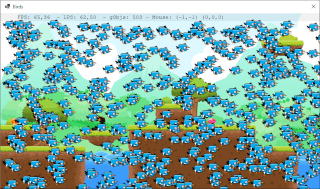
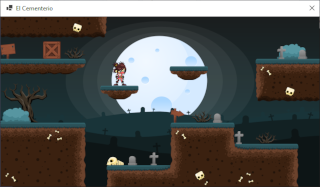
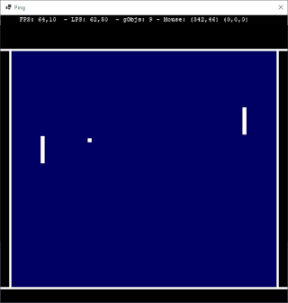
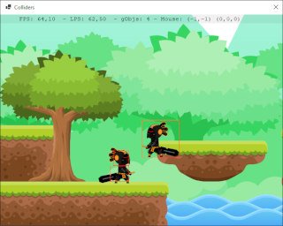

# CSLittleGameEngine

Un pequeño motor de juegos para aprender C#

 

 

## Pendientes Linux/Mono

- Problemas con TTF en Linux/Mono no existen en VM debian bullseye
- Sonidos cortos no se reproducen
- No cierra bien a veces con sonido habilitado
